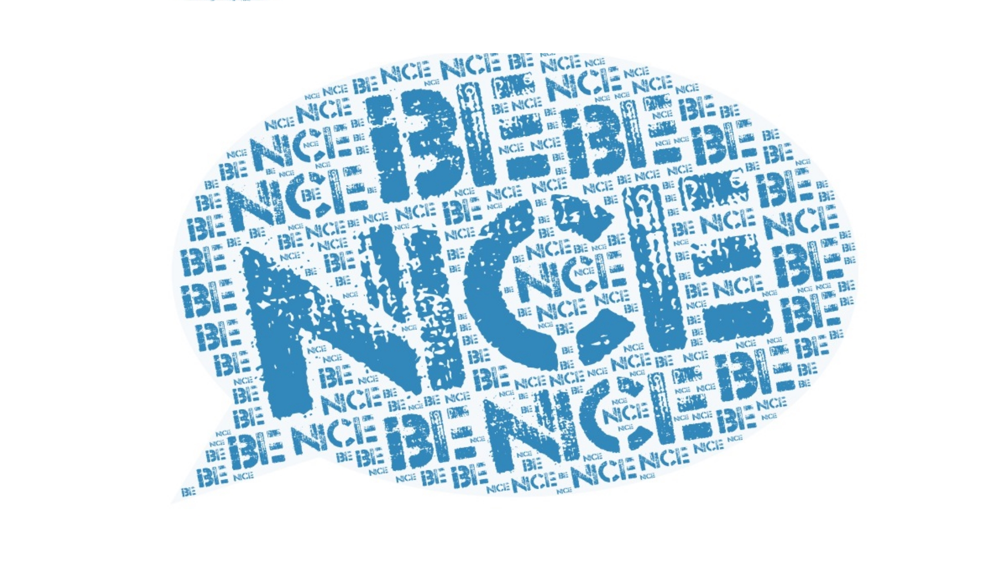

**Be Nice** is a Google Home Action that will compliment you or anyone you want to compliment

## Deployment

Deploy to gcloud functions:

```sh
gcloud beta functions deploy beNice --stage-bucket be-nice --trigger-http --entry-point beNice
```

## Usage

Start Be Nice on Google Assistant (on phone, Allo, or Google Home):
> Hey Google, talk to be nice

> Hey Google, ask be nice to compliment me 

Compliment Someone:
> Compliment Annie

> Give Annie a compliment

Compliment Anyone:
> Compliment Me

> Give me a compliment